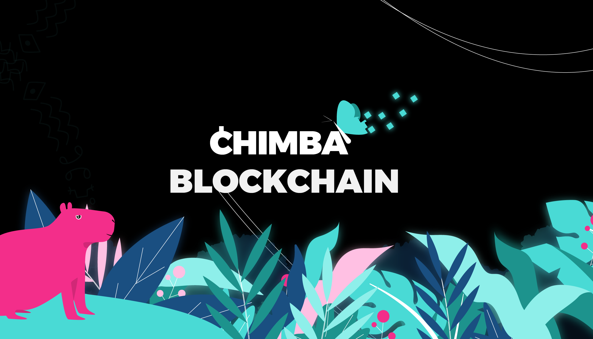

Chimba es una plataforma de código abierto para contratos inteligentes interoperables que ejecutan, controlan o documentan automáticamente un procedimiento de eventos y acciones de acuerdo con los términos del contrato o acuerdo para que sean válidos y utilizables en múltiples redes soberanas.

Chimba es una blockchain pública creada en el ecosistema Cosmos. Su objetivo es proporcionar un entorno sandbox para el despliegue de contratos inteligentes interoperables. La red sirve como una zona descentralizada, sin permisos y resistente a la censura para que los desarrolladores lancen de forma eficiente y segura contratos inteligentes específicos de la aplicación.

Chimba tiene su origen en una iniciativa impulsada por la comunidad de Colombia, promovida por desarrolladores, validadores y delegados del ecosistema Cosmos. La visión común es preservar la neutralidad, el rendimiento y la fiabilidad del Hub Cosmos. 

Chimba es una blockchain construida usando Cosmos SDK y Tendermint y creada con Starport.